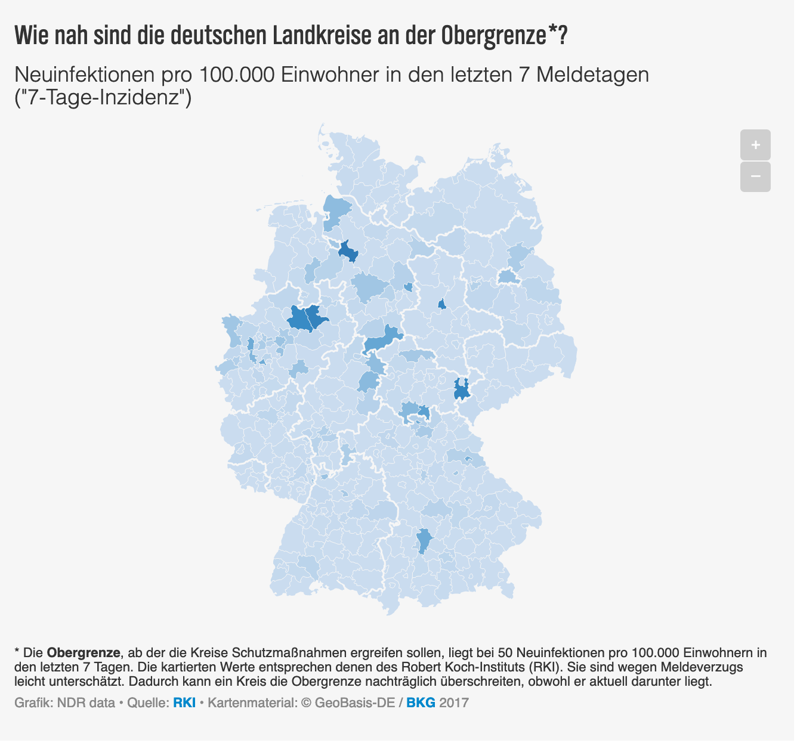

# Corona-Daten des NDR für die Öffentlichkeit

Hier stellt das Datenteam des Norddeutschen Rundfunks (NDRdata) der Öffentlichkeit aktuelle und historische Daten zur Corona-Pandemie zur Verfügung. Jeder kann sie herunterladen und kostenfrei nutzen (siehe [Nutzungsbedingungen](#Lizenz)).

Der NDR möchte so als Teil seines öffentlich-rechtlichen Auftrages sicherstellen, dass diese Daten jetzt und dauerhaft als saubere und maschinenlesbare Datensätze in gleichbleibendem Format allgemein verfügbar sind, um die Coronakrise nachzuvollziehen, zu analysieren und zu erforschen. Das Angebot richtet sich nicht nur an die Medien und die Wissenschaft, sondern an jeden Interessierten.

Zudem stellt der NDR zwei interaktive Karten zur eigenen Nutzung und Veränderung zur Verfügung, die den aktuellen Verlauf der Covid-19 Neuinfektionen in den Stadt- und Landkreisen zeigen.

## Welche Daten gibt es hier?

Es handelt sich vor allem um die Fallzahlen der an Covid-19 Erkrankten als "Kerndaten" der Pandemie in unterschiedlicher regionaler Auflösung und aus unterschiedlichen Quellen. Zusätzlich enthalten die Datensätzen verschiedene Indikatoren, etwa die Zahl der Neuinfektionen pro 100.000 Einwohner für jedes deutsche Bundesland. Die Daten waren und sind auch Grundlage für die NDR-Berichterstattung in Fernsehen, Radio und auf [ndr.de](https://www.ndr.de/ "Webseite des NDR").

Die Datensätze sind stets tagesaktuell (teilweise aktualisieren sie sich mehrfach täglich).

Da sich die Corona-Daten der Originalquellen (Robert Koch-Institut oder Landesministerien) oft täglich überschreiben, sind dort immer nur aktuellen Tageswerte zu sehen - und Zeitvergleiche nicht möglich. Das NDRdata-Team greift viele dieser Tageswerte automatisiert ab und stellt sie hier bereinigt als konsistente Zeitreihen zur Verfügung.

## Lizenz

Alle Daten können frei und kostenlos unter der [Open Data Datenlizenz Deutschland – Namensnennung – Version 2.0](https://www.govdata.de/dl-de/by-2-0) genutzt werden. Die Quellenvermerke sind bei den jeweilige Datensäten genannt (s.u.). Beachten Sie bitte auch den [Haftungsausschluss unten](#Haftungsausschluss).

## Alle Meldedaten des Robert-Koch-Instituts

Das Robert-Koch-Institut (RKI) stellt mit seinem ["RKI COVID 19"-Datensatz](https://npgeo-corona-npgeo-de.hub.arcgis.com/datasets/dd4580c810204019a7b8eb3e0b329dd6_0/data) die wichtigste und vollständigste amtliche Datensammlung mit Covid-19 Fallzahlen nach Meldetag, Alter, Geschlecht, Landkreis und anderen Merkmalen zur Verfügung. Der Datensatz überschreibt sich täglich, so dass alte Datensätze nicht mehr vorliegen.

Wir stellen hier für jeden Tag seit dem 31. März 2020 eine komplette Kopie dieser täglichen Datensätze zur Verfügung, die wir auf Vollständigkeit geprüft, bereinigt, und in ein einheitliches Format gebracht haben. Eine Beschreibung der Spalten und ihrer Bedeutung findet sich in den [Metadaten](https://www.arcgis.com/home/item.html?id=dd4580c810204019a7b8eb3e0b329dd6).

Sämtliche Datumsspalten sind im [ISO-Datumsformat JJJJ-MM-TT](https://de.wikipedia.org/wiki/ISO_8601#Datum) angegeben. Dabei bedeuten: JJJJ = 4-stelliges Jahr, MM = 2-stelliger Monat, TT = 2-stelliger Tag im Monat. Der 16. Juli 2020 wäre also im ISO-Format `2020-07-16`, der 23. August 2020 wäre beispielsweise `2020-08-23`.

**Der Datensatz zu einem bestimmten Datum** findet sich unter der URL https://storage.googleapis.com/public.ndrdata.de/rki_covid_19_bulk/daily/covid_19_daily_2020-06-16.tsv.gz, wobei anstelle der Zeichenfolge `2020-06-16` das gewünschte Datum im ISO-Format (siehe oben) angegeben werden muss.

**Eine große Tabelle, die alle Datensätze mit Datenständen ab dem 31. März 2020 zusammenfasst**, lässt sich hier herunterladen: https://storage.googleapis.com/public.ndrdata.de/rki_covid_19_bulk/covid_19_bulk.tsv.gz Diese Tabelle ermöglicht insbesondere Untersuchungen von Verzögerungen zwischen dem Zeitpunkt der Meldung des Falles in der Region des Ausbruchs und der Weitergabe der Information an das RKI, aber auch fortgeschrittene Berechnungen wie sogenannte Nowcasts.

Alle Dateien liegen als [CSV-Dateien](https://de.wikipedia.org/wiki/CSV_(Dateiformat)) vor. Das Trennnzeichen der Spalten ist der Tabulator (`\t`). Die Dateien sind komprimiert und tragen darum die Endung `gz`. Unter Windows lassen sie sich beispielsweise mit dem kostenfreien Programm [7-Zip](https://www.7-zip.org/) dekomprimieren, auf Apple-Rechnern einfach per Doppelklick im Finder.

**Quellenvermerk: Robert Koch-Institut (RKI), dl-de/by-2-0**

## Meldedaten der lokalen Behörden für die Bundesländer **NUR IM NORDNE??**(Zeitreihen)

Auch die Bundesländer melden Corona-Fallzahlen. Sie stammen aus den lokalen Gesundheitsämtern, und werden je nach Bundesland von Staatskanzlei oder den Gesundheitsministerien veröffentlicht. Hier werden viele Fälle früher erfasst als beim RKI, da die Meldung nach Berlin bis zu mehreren Tagen dauern kann. Die an einem Tag gemeldeten Fälle haben aber den Nachteil, dass sie an ganz verschiedenen, zurückliegenden Tagen in den lokalen Gesundheitsämtern bekannt geworden sind. Im "RKI COVID 19"-Datensatz hingegen (s.o.) sind die Erkrankungen korrekt dem Meldedatum vor Ort zugeordnet - der Verlauf der Epidemie lässt sich also besser nachvollziehen.

In den folgenden Dateien finden sich die Anzahl der Neuinfektionen, wie sie das jeweilige Ministerium und im Vergleich das Robert Koch-Institut angeben. Ebenso die bestätigten Todesfälle aus beiden Institutionen und die vom NDR anhand der jeweiligen Einwohnerzahl eines Bundeslands berechneter Inzidenz-Wert, also die Anzahl der Infektionen oder Todesopfer pro 100.000 Einwohner. Außerdem liefern einige Bundesländer weitere Informationen, wie zum Beispiel die Zahl der Genesenen. Eine Beschreibung aller Spalten finden Sie in [dieser Excel-Datei](/data/coronadownload112.xlsx "Download starten: Datenfelder der CSV-Dateien (XLSX)").

**Quellenvermerk: Robert Koch-Institut (RKI), Landesministerien, dl-de/by-2-0**

*   [CSV-Download: Aktuelle Corona-Zahlen der Landkreise](https://storage.googleapis.com/ndrdata-corona-csv/csv/landkreise_aktuell.csv "Link: CSV-Download: Aktuelle Corona-Zahlen der Landkreise")
*   [CSV-Download: Aktuelle Corona-Zahlen Schleswig-Holstein](https://storage.googleapis.com/ndrdata-corona-csv/csv/aktueller_stand_schleswig_holstein.csv "Link: CSV-Download: Aktuelle Corona-Zahlen Schleswig-Holstein")
*   [CSV-Download: Aktuelle Corona-Zahlen Hamburg](https://storage.googleapis.com/ndrdata-corona-csv/csv/aktueller_stand_hamburg.csv "Link: CSV-Download: Aktuelle Corona-Zahlen Hamburg")
*   [CSV-Download: Aktuelle Corona-Zahlen Niedersachsen](https://storage.googleapis.com/ndrdata-corona-csv/csv/aktueller_stand_niedersachsen.csv "Link: CSV-Download: Aktuelle Corona-Zahlen Niedersachsen")
*   [CSV-Download: Aktuelle Corona-Zahlen Bremen](https://storage.googleapis.com/ndrdata-corona-csv/csv/aktueller_stand_bremen.csv "Link: CSV-Download: Aktuelle Corona-Zahlen Bremen")
*   [CSV-Download: Aktuelle Corona-Zahlen Mecklenburg-Vorpommern](https://storage.googleapis.com/ndrdata-corona-csv/csv/aktueller_stand_mecklenburg_vorpommern.csv "Link: CSV-Download: Aktuelle Corona-Zahlen Mecklenburg-Vorpommern")
*   [Datenfelder der CSV-Dateien (XLSX)](/data/coronadownload112.xlsx "Download starten: Datenfelder der CSV-Dateien (XLSX)")

## Karten:

Die folgenden sich täglich aktualisierende interaktiven Corona-Karten können über den [Datawrapper-River](https://river.datawrapper.de/) kostenlos und frei auf eigenen Webseiten eingebunden werden. Sie lassen sich zuvor noch individuell anpassen. Programmierkenntnisse sind dazu nicht nötig.

Die Karten zeigen die "7-Tage-Inzidenz" der Neuinfektionen mit Covid-19 für alle Land- und Stadtkreise in Nord- oder Gesamtdeutschland. Die 7-Tage.Inzidenz ist die Summer der Neuinfektionen über die letzten 7 Tage, gerechnet auf 100.000 Einwohner.

Je dunkler das Blau einer Fläche auf der Karte, desto näher ist der Kreis der Obergrenze von 50 Neuinfektionen pro 100.000 Einwohner, ab der Maßnahmen ergriffen werden müssen. Kreise mit einer 7-Tage-Inzidenz über 50 sind rot.

Der Tooltip zeigt für jeden Kreis den Verlauf der letzten 14 Tage.

Datenquelle: [RKI Covid-19-Datensatz](https://npgeo-corona-npgeo-de.hub.arcgis.com/datasets/dd4580c810204019a7b8eb3e0b329dd6_0/data)

### Karte für Gesamtdeutschland:

Link im Datawrapper-River: https://river.datawrapper.de/_/HVqu8

### Karte für Norddeutschland:

Link im Datawrapper-River: https://river.datawrapper.de/_/7OsDa

## Sammeln Sie mit uns Daten!

Sie haben interessante Daten zur Coronakrise? Z.B. ältere Versionen des ["RKI Covid-19"](#Die-Basis:-RKI-Mirror-&-Bulk)-Datensatzes? Melden Sie sich beim NDRdata-Team!

Fragen und Anregungen nehmen wir gerne unter [data@ndr.de](mailto:data@ndr.de "Link: Link zur E-Mail-Adresse data@ndr.de") entgegen.

## Haftungsausschluss

*Haftungsausschluss: Die Inhalte dieser Seite dienen ausschließlich der allgemeinen Information der Öffentlichkeit. Der NDR übernimmt keine Verantwortung für die Richtigkeit und Vollständigkeit der Daten und Informationen, ob auf dieser Seite angegeben oder verlinkt, für Abweichungen von Originaldaten, Übertragungsfehler oder Veränderung der Informationen durch Dritte.*
